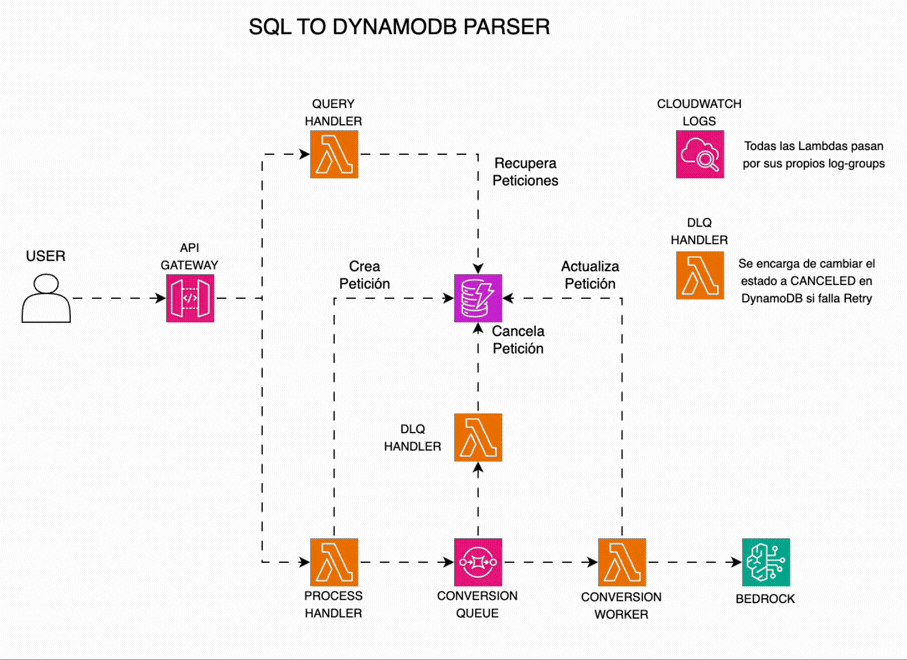

# SQL to DynamoDB Converter

Herramienta serverless que convierte esquemas SQL relacionales a diseños optimizados de DynamoDB usando IA, generando automáticamente tabla designs, índices secundarios globales (GSI) y código Terraform.

## El Problema

Migrar de bases de datos relacionales (SQL) a DynamoDB requiere:

- Rediseñar esquemas de relacional a NoSQL
- Identificar patrones de acceso óptimos
- Crear índices secundarios apropiados
- Configurar infraestructura como código

Este proceso es complejo, propenso a errores y requiere expertise en modelado DynamoDB.

## La Solución

Aplicación web que analiza tus `CREATE TABLE` statements SQL y genera:

- **DynamoDB Table Designs**: Esquemas optimizados con partition/sort keys
- **Global Secondary Indexes (GSI)**: Recomendaciones basadas en relaciones SQL
- **Access Patterns**: Documentación de cómo consultar eficientemente
- **Terraform Code**: IaC listo para desplegar en AWS
- **Análisis con IA**: Usa Amazon Bedrock (Claude) para optimizaciones inteligentes

## Stack Tecnológico

- **Backend**: AWS Lambda (Go) con ARM64 Graviton2
- **IA/ML**: Amazon Bedrock (Claude)
- **Storage**: DynamoDB con TTL de 24 horas
- **Queue**: Amazon SQS para procesamiento asíncrono
- **Infraestructura**: Terraform modular (soporta LocalStack para dev, AWS para prod)
- **API Gateway**: REST v1 (LocalStack) / HTTP v2 (AWS)
- **Observabilidad**: CloudWatch Logs y métricas

## Arquitectura



El sistema implementa un patrón de procesamiento asíncrono con los siguientes componentes:

### Componentes principales:

1. **API Gateway**: Punto de entrada para todas las solicitudes HTTP
2. **Process Handler Lambda**: Valida sintaxis SQL, crea petición en estado PENDING y encola mensaje en SQS
3. **Query Handler Lambda**: Recupera conversiones de la BD (listado y detalle individual)
4. **Schemas Table (DynamoDB)**: Almacena conversiones con TTL de 24 horas y GSI por fecha
5. **Conversion Queue (SQS)**: Desacopla la recepción de solicitudes del procesamiento de IA
6. **Conversion Worker Lambda**: Consume mensajes de SQS, invoca Bedrock y actualiza resultados en DynamoDB
7. **Amazon Bedrock (Claude)**: Motor de IA que genera diseños optimizados de DynamoDB
8. **CloudWatch Logs**: Registro centralizado de todas las operaciones

### Flujo de procesamiento:

1. Usuario envía SQL via API Gateway → Process Handler
2. Process Handler valida sintaxis SQL
3. Process Handler crea petición en estado PENDING en DynamoDB
4. Mensaje se encola en SQS
5. Conversion Worker consume mensaje y actualiza estado a PROCESSING
6. Worker invoca Bedrock para análisis de IA
7. Resultado se almacena con estado COMPLETED o FAILED
8. Usuario consulta resultado via API Gateway → Query Handler
9. CloudWatch registra todas las operaciones

## Estructura del Proyecto

```
├── lambda/           # Funciones Go (converter, frontend-proxy)
├── web/              # Frontend SPA
├── infra/terraform/  # Módulos IaC
│   ├── modules/      # Lambda, API Gateway, IAM, S3, Bedrock
│   └── environments/ # Configuraciones dev/prod
└── spec/             # Requirements y plan de implementación
```

## Features

- **Procesamiento Asíncrono**: Desacoplamiento con SQS para manejar largos tiempos de IA
- **Conversiones del Día**: Modelo público efímero con TTL de 24 horas
- **Validación SQL**: Detecta errores de sintaxis antes de convertir
- **Optimización configurable**: Read-heavy, write-heavy, balanced
- **Single-table design**: Sugiere patrones de tabla única cuando aplica
- **Estados de conversión**: PENDING → PROCESSING → COMPLETED/FAILED
- **Seguridad**: Zero-trust, HTTPS end-to-end, IAM least privilege
- **Observabilidad**: CloudWatch logs, métricas, alarmas automáticas
- **Multi-ambiente**: LocalStack (dev) y AWS (producción)

## Casos de Uso

- Migración de aplicaciones legacy SQL a serverless DynamoDB
- Aprendizaje de modelado NoSQL desde esquemas relacionales conocidos
- Generación rápida de prototipos de infraestructura DynamoDB
- Análisis de patrones de acceso para schemas existentes

## API Endpoints

- `POST /convert` - Envía esquema SQL, retorna `{id, status: "PENDING"}`
- `GET /conversions` - Lista todas las conversiones del día actual
- `GET /conversions/{id}` - Obtiene detalle de una conversión específica
- `GET /health` - Verifica disponibilidad del sistema

## Desarrollado con

AWS Lambda • Amazon Bedrock • DynamoDB • SQS • Terraform • Go
