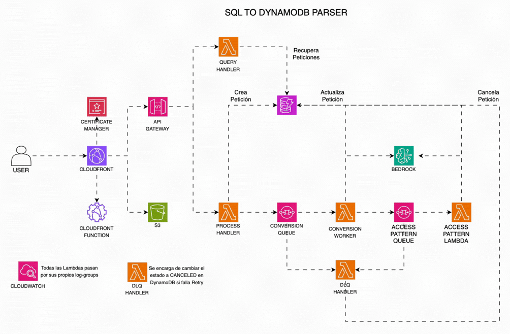

# SQL to DynamoDB Converter

Plataforma serverless que convierte esquemas SQL relacionales a diseños optimizados de Amazon DynamoDB usando inteligencia artificial. Analiza sentencias `CREATE TABLE`, genera table designs con partition/sort keys, índices secundarios globales (GSI), patrones de acceso documentados y código Terraform listo para producción.

## El Problema

Migrar de bases de datos relacionales a DynamoDB es un proceso que requiere rediseñar esquemas completos, identificar patrones de acceso, definir índices secundarios y configurar infraestructura. Este trabajo es manual, propenso a errores y demanda expertise específico en modelado NoSQL.

## La Solución

Una aplicación web donde el usuario pega sus `CREATE TABLE` statements y obtiene:

- **DynamoDB Table Designs** — Esquemas optimizados con partition key y sort key
- **Global Secondary Indexes (GSI)** — Índices derivados de las relaciones SQL originales
- **Access Patterns** — Documentación de cómo consultar cada entidad eficientemente
- **Terraform Code** — Infraestructura como código lista para desplegar
- **Análisis con IA** — Amazon Bedrock (Claude) genera y optimiza cada conversión

## Arquitectura



### Flujo de procesamiento

1. El usuario envía SQL desde el frontend → **API Gateway** → **Process Handler**
2. Process Handler valida la sintaxis SQL, crea un registro `PENDING` en DynamoDB y encola un mensaje en SQS
3. **Conversion Worker** consume el mensaje, invoca **Bedrock (Claude 3.5 Sonnet)** para generar el diseño DynamoDB y actualiza el estado a `DESIGN_COMPLETED`
4. Se encola un segundo mensaje para el **Access Pattern Worker**, que invoca **Bedrock (Claude 3.5 Haiku)** para generar patrones de acceso y marca la conversión como `COMPLETED`
5. El usuario consulta el resultado via **Query Handler**
6. Si cualquier paso falla tras 3 reintentos, el mensaje llega a su respectiva Dead Letter Queue (**Conversion DLQ** o **Access Pattern DLQ**) y el **DLQ Handler** unificado marca la conversión como `FAILED`

### Estados de una conversión

```
PENDING → PROCESSING → DESIGN_COMPLETED → PROCESSING_PATTERNS → COMPLETED
                ↓                                    ↓
              FAILED                               FAILED
```

## Servicios AWS

### Compute

| Servicio                   | Uso                                                                                                   |
| -------------------------- | ----------------------------------------------------------------------------------------------------- |
| **AWS Lambda (Go, ARM64)** | 6 funciones: Process Handler, Conversion Worker, Access Pattern Worker, Query Handler, Admin Handler, DLQ Handler |
| **Amazon Bedrock**         | Claude 3.5 Sonnet v2 para conversión de esquemas, Claude 3.5 Haiku para generación de access patterns |

### Storage y Messaging

| Servicio            | Uso                                                                                                                                                                         |
| ------------------- | --------------------------------------------------------------------------------------------------------------------------------------------------------------------------- |
| **Amazon DynamoDB** | Tabla `schemas` con TTL de 24 horas y GSI por fecha para listar conversiones del día                                                                                        |
| **Amazon SQS**      | Cola de conversión + DLQ, cola de access patterns + DLQ. Cada cola tiene su propia Dead Letter Queue (3 reintentos máximos). Un DLQ Handler unificado consume de ambas DLQs |
| **Amazon S3**       | Hosting de assets estáticos del frontend (SPA)                                                                                                                              |

### Networking y Seguridad

| Servicio                          | Uso                                                                                          |
| --------------------------------- | -------------------------------------------------------------------------------------------- |
| **Amazon CloudFront**             | CDN con dos orígenes: S3 (frontend) y API Gateway (API). Origin Access Control (OAC) para S3 |
| **AWS Certificate Manager (ACM)** | Certificado SSL para el dominio personalizado, validado por DNS                              |
| **AWS API Gateway (HTTP v2)**     | Punto de entrada REST con rutas para `/api/v1/schemas`, `/api/v1/users`, `/api/v1/tenants`  |
| **AWS Cognito**                   | User Pool con grupos multi-tenant (SUPER_ADMIN, REALM_ADMIN, REALM_SUPERVISOR, USER_TENANT) |
| **AWS IAM**                       | Un rol por Lambda con políticas de mínimo privilegio                                         |

### Observabilidad

| Servicio              | Uso                                              |
| --------------------- | ------------------------------------------------ |
| **Amazon CloudWatch** | Logs centralizados de todas las funciones Lambda |

## Cloudflare + CloudFront: Seguridad perimetral

El frontend se sirve a través de **Cloudflare → CloudFront → S3/API Gateway**, con dos capas de protección:

### Certificado ACM + Full (strict) SSL

Cloudflare opera en modo **Full (strict)**, lo que requiere un certificado válido en el origen. ACM provee un certificado para `app-sql.cloudcentinel.com` que CloudFront presenta en cada conexión TLS. La validación del certificado es por DNS (CNAME en Cloudflare).

### Header secreto con CloudFront Function

Para evitar que alguien acceda directamente a CloudFront bypasseando Cloudflare, una **CloudFront Function** valida un header secreto en cada request:

```js
function handler(event) {
  var request = event.request;
  var secret = request.headers["x-origin-secret"];
  if (!secret || secret.value !== "EXPECTED_VALUE") {
    return { statusCode: 403, statusDescription: "Forbidden" };
  }
  return request;
}
```

Cloudflare inyecta este header automáticamente via **Transform Rule** antes de enviar el request a CloudFront. Cualquier request que llegue sin el header recibe un `403 Forbidden`.

**Resultado:**

- `curl https://<cloudfront-domain>/` → `403`
- `curl https://app-sql.cloudcentinel.com/` → `200`

## Stack Tecnológico

| Capa                | Tecnología                                                  |
| ------------------- | ----------------------------------------------------------- |
| **Frontend**        | Vue 3, PrimeVue, Pinia, Vue Router, TypeScript, Vite        |
| **Backend**         | Go (ARM64 Graviton), AWS Lambda                             |
| **IA**              | Amazon Bedrock (Claude 3.5 Sonnet v2, Claude 3.5 Haiku)     |
| **Autenticación**   | AWS Cognito (User Pool, grupos multi-tenant)                |
| **Infraestructura** | Terraform modular (10 módulos), S3 backend para state       |
| **CDN/Security**    | Cloudflare (proxy, WAF, Transform Rules) + CloudFront + ACM |
| **Dev local**       | LocalStack Pro con API Gateway REST v1                      |

## Estructura del Proyecto

```
├── lambda/                        # Funciones Lambda en Go
│   ├── diagrams/                  # Process Handler — validación SQL y encolado
│   ├── conversion-worker/         # Conversión SQL → DynamoDB via Bedrock
│   ├── access-pattern-worker/     # Generación de access patterns via Bedrock
│   ├── query/                     # Consulta de conversiones
│   ├── admin-handler/             # Gestión de usuarios y tenants
│   └── dlq-handler/               # Manejo de mensajes fallidos
├── web/db-parser/                 # Frontend Vue 3 SPA
│   └── src/
│       ├── views/                 # HomeView, HistoryView, TenantsView, LoginView
│       ├── components/            # Sidebar
│       ├── services/              # schemasApi, adminApi, authService
│       ├── stores/                # Pinia stores (auth)
│       └── models/                # TypeScript interfaces
├── docs/                          # Documentación detallada
│   ├── infrastructure/            # Guía de Terraform y módulos
│   ├── backend/                   # Guía de Lambda/Go
│   ├── frontend/                  # Guía de Vue
│   └── architecture/              # Diagramas y flujos
├── infra/terraform/
│   ├── modules/                   # Módulos reutilizables
│   │   ├── lambda/                # Configuración Lambda genérica
│   │   ├── gateway/               # API Gateway (HTTP v2 + REST v1 + wrapper)
│   │   ├── dynamodb/              # Tabla con TTL y GSI
│   │   ├── sqs/                   # Colas + DLQ
│   │   ├── s3/                    # Bucket frontend con upload de assets
│   │   ├── cloudfront/            # CDN + OAC + ACM + CloudFront Function
│   │   ├── cognito/               # User Pool + Client + Groups
│   │   ├── bedrock/               # Model access y políticas IAM
│   │   └── iam/                   # Roles y políticas por Lambda
│   ├── environments/
│   │   ├── dev/                   # LocalStack (desarrollo local)
│   │   └── prod/                  # AWS (producción)
│   └── backend/                   # S3 backend para Terraform state
└── spec/                          # Requerimientos y diagramas
```

## Sistema de Autenticación Multi-Tenant

### Roles y Permisos

| Rol                  | Descripción                           | Acceso                       |
| -------------------- | ------------------------------------- | ---------------------------- |
| **SUPER_ADMIN**      | Administrador global                  | Todos los tenants y usuarios |
| **REALM_ADMIN**      | Administrador de tenant               | Usuarios de su tenant        |
| **REALM_SUPERVISOR** | Supervisor con permisos de lectura    | Conversiones de su tenant    |
| **USER_TENANT**      | Usuario estándar                      | Conversiones de su tenant    |

### Gestión Unificada

- **Vista de Tenants**: Click en fila → Modal con usuarios del tenant
- **Creación de usuarios**: Directamente desde el modal del tenant
- **Aislamiento**: Cada tenant solo ve sus propios datos
- **Roles configurables**: SUPER_ADMIN puede asignar REALM_ADMIN

## API Endpoints

### Conversiones SQL

| Método | Ruta                   | Descripción                                  |
| ------ | ---------------------- | -------------------------------------------- |
| `POST` | `/api/v1/schemas`      | Envía SQL, retorna `{id, status: "PENDING"}` |
| `GET`  | `/api/v1/schemas`      | Lista conversiones del día actual            |
| `GET`  | `/api/v1/schemas/{id}` | Detalle de una conversión específica         |

### Administración (requiere autenticación)

| Método | Ruta              | Roles                    | Descripción      |
| ------ | ----------------- | ------------------------ | ---------------- |
| `GET`  | `/api/v1/users`   | SUPER_ADMIN, REALM_ADMIN | Listar usuarios  |
| `POST` | `/api/v1/users`   | SUPER_ADMIN, REALM_ADMIN | Crear usuario    |
| `GET`  | `/api/v1/tenants` | SUPER_ADMIN, REALM_ADMIN | Listar tenants   |
| `POST` | `/api/v1/tenants` | SUPER_ADMIN              | Crear tenant     |

## Quick Start

```bash
# Construir todas las Lambdas
make lambda

# Construir frontend
make frontend

# Deploy a producción
make prod

# Deploy frontend a S3 + invalidar cache CloudFront
make deploy-frontend
```

## Desarrollo Local

```bash
# Levantar LocalStack
make docker-up

# Desplegar infraestructura local
make localstack

# Destruir entorno local
make localstack-destroy
```

## Documentación

| Documento | Descripción |
| --------- | ----------- |
| [CLAUDE.md](CLAUDE.md) | Resumen ejecutivo del proyecto |
| [docs/infrastructure/](docs/infrastructure/README.md) | Guía detallada de Terraform (~2,600 líneas) |
| [docs/backend/](docs/backend/README.md) | Documentación de Lambda/Go |
| [docs/frontend/](docs/frontend/README.md) | Documentación de Vue 3 |
| [docs/architecture/](docs/architecture/README.md) | Diagramas y flujos del sistema |
